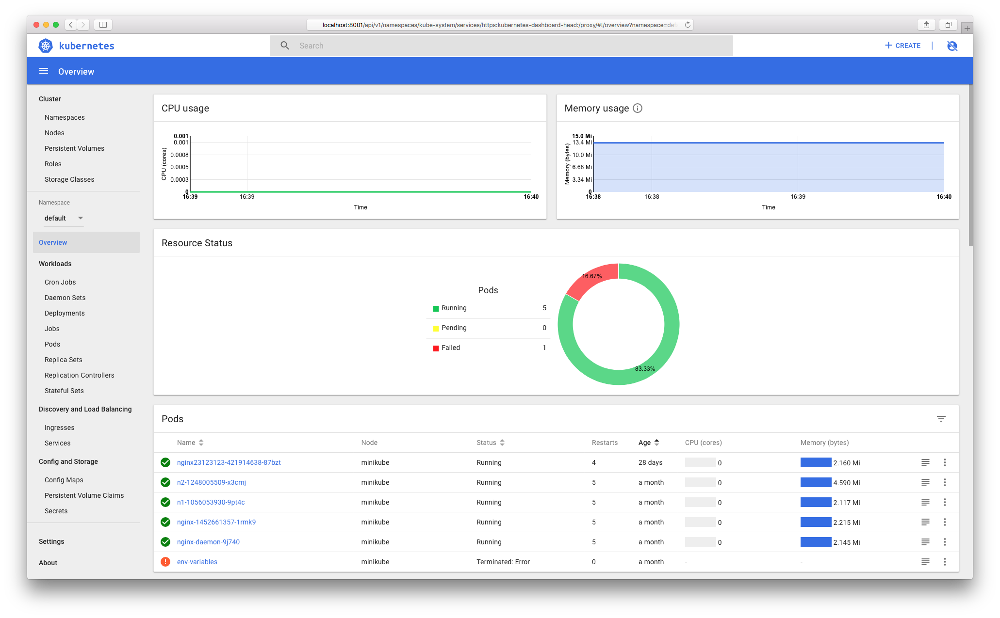

# Kubernetes Dashboard

[](https://travis-ci.org/kubernetes/dashboard)
[](https://goreportcard.com/report/github.com/kubernetes/dashboard)
[](https://greenkeeper.io/)
[](https://codecov.io/github/kubernetes/dashboard?branch=master)
[](https://github.com/kubernetes/dashboard/releases/latest)
[](https://github.com/kubernetes/dashboard/blob/master/LICENSE)

Kubernetes Dashboard is a general purpose, web-based UI for Kubernetes clusters. It allows users to manage applications
running in the cluster and troubleshoot them, as well as manage the cluster itself.



## Getting Started

**IMPORTANT:** Since version 1.7 Dashboard uses more secure setup. It means, that by default it has minimal set of
privileges and can only be accessed over HTTPS. It is recommended to read [Access Control](
https://github.com/kubernetes/dashboard/wiki/Access-control) guide before performing any further steps.

To deploy Dashboard, execute following command:

```sh
$ kubectl apply -f https://raw.githubusercontent.com/kubernetes/dashboard/master/src/deploy/recommended/kubernetes-dashboard.yaml
```

To access Dashboard from your local workstation you must create a secure channel to your Kubernetes cluster. Run the following command:

```sh
$ kubectl proxy
```
Now access Dashboard at:


[`http://localhost:8001/api/v1/namespaces/kube-system/services/https:kubernetes-dashboard:/proxy/`](
http://localhost:8001/api/v1/namespaces/kube-system/services/https:kubernetes-dashboard:/proxy/).

To find out how to create sample user and log in follow [Creating sample user](https://github.com/kubernetes/dashboard/wiki/Creating-sample-user) guide.

**NOTE:**
* The shortcut `http://localhost:8001/ui` is deprecated. Use the full proxy URL shown above.
* [Heapster](https://github.com/kubernetes/heapster/) has to be running in the cluster for the metrics
and graphs to be available. Read more about it in [Integrations](
https://github.com/kubernetes/dashboard/wiki/Integrations) guide.

## Documentation

Dashboard documentation can be found on [Wiki](https://github.com/kubernetes/dashboard/wiki) pages, it includes:

* Common: Entry-level overview

* User Guide: [Installation](https://github.com/kubernetes/dashboard/wiki/Installation), [Accessing Dashboard](
https://github.com/kubernetes/dashboard/wiki/Accessing-dashboard) and more for users

* Developer Guide: [Getting Started](https://github.com/kubernetes/dashboard/wiki/Getting-started), [Dependency
Management](https://github.com/kubernetes/dashboard/wiki/Dependency-management) and more for anyone interested in
contributing

## License

The work done has been licensed under Apache License 2.0. The license file can be found [here](LICENSE). You can find
out more about the license at [www.apache.org/licenses/LICENSE-2.0](//www.apache.org/licenses/LICENSE-2.0).
