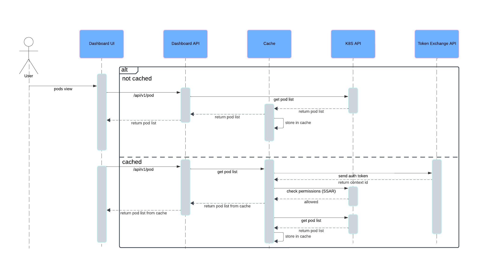

# Table of Contents
- [Motivation](#motivation)
  - [Goals](#goals)
  - [Non-Goals](#non-goals)
  - [Terminology](#terminology)
- [Proposal](#proposal)
- [Design](#design)
- [Implementation](#implementation)

## Motivation
The Kubernetes Dashboard has been around for a long time now, and one of its pain points have always been the performance and responsiveness when running in clusters with a large number of resources. Given that, we have been thinking about implementing a proper API caching solution to enhance overall responsiveness and user experience. As clusters grow in size and complexity, users often face latency issues when interacting with the Dashboard, which can lead to inefficiencies in managing and troubleshooting applications. By implementing a proper caching solution, we can significantly reduce the time it takes to retrieve resource data, decrease peak memory usage and optimize overall resource consumption, thereby minimizing delays and improving the fluidity of the user interface.

### Goals
The primary goals of implementing the API caching solution are to:
- **Reduce Latency**: Minimize the time required to retrieve data from the Dashboard API during consecutive requests, enabling faster access to information.
- **Enhance User Experience**: Provide a smoother, more responsive interface for users managing complex clusters.
- **Optimize Resource Utilization**: Decrease the pressure on the Kubernetes API server by caching frequently accessed data, thus improving overall cluster performance.
- **Support Scalability**: Ensure the solution can accommodate clusters of varying sizes and complexities without degrading performance. Cache should be running in multi-cluster as well as in the single-cluster setup.
- **Configurability**: Provide opt-out and other configuration options.

### Non-Goals
This proposal does not aim to:

- **Replace Existing API Functionality**: The caching solution will transparently work with, not replace, the existing API endpoints and interactions.
- **Introduce Complexity for Users**: The implementation should remain transparent to users, avoiding any additional steps or configurations.
- **Cover All Resource Types Equally**: While the caching solution will enhance responsiveness, it may initially focus on the most frequently accessed resource types rather than attempting to cache every possible resource.

### Terminology
- **API Caching**: The process of storing responses from API requests temporarily to reduce the need for repeated fetching of the same data.
- **Resource**: An entity within Kubernetes, such as pods, services, deployments, etc., that users manage through the Dashboard.
- **Latency**: The time delay between a user action and the corresponding response from the system.

## Proposal
The proposed solution involves implementing a caching layer within the Kubernetes Dashboard that stores a configurable number of API responses for a configurable duration. This caching layer will hook into Kubernetes client interfaces and serve cached data when available, falling back to the API server only when necessary. The solution will leverage techniques such as time and cost-based expiration and cache invalidation strategies to ensure data freshness while balancing performance. 

In general, it will resemble the "cache-and-network" type of caching due to the nature of Dashboard auth layer. Since Dashboard does not require any permissions on its own, it has to rely on the user permissions and the only time when it can act as a user is the time from receiving a request to sending a response. Such an architecture requires an on-the-fly client creation as well as background cache updates.

To ensure that cached data will not be served to unauthorized entities, every time before API returns data from the cache, it will first create a Self Subject Access Review request to the API server to validate user permissions. 

It is especially important in a multi-cluster scenarios where Dashboard API is used to access multiple clusters. To avoid the situation where path stored in cache could be served from the wrong cluster context, multi-cluster cache context needs to have a way to exchange user authorization token for a unique context ID and it has to be a part of the cache key.

Cache key should consist of the below fields:
- **Kind**: resource kind
- **Namespace**: optional namespace name
- **List Options**: `v1.ListOptions` should also be part of the key to ensure that filtered API requests are stored under a separate cache key
- **Context ID**: optional context (cluster) identifier, used only in multi-context caching, controlled by dedicated argument

SHA should be created based on the above key structure and used as an internal cache key.

## Design
These sequence diagrams show simplified way of how cache works.

### Standard Caching

1. User requests to see a cached resource view
2. API checks if unique key generated based on the request has a corresponding value in the cache
   1. In case value is not cached, return the data directly from K8S API and cache it.
   2. In case value is cached, create a Self Subject Access Review to check user permissions, return cached data and in background request latest data from K8S API to update cache.

### Multi-Context Caching

The flow is very similar to the standard caching with the difference being that provided user authorization token has to be able to be exchanged for the unique context ID using configured `token-exchange-endpoint`. It is then used to create unique cache key.

## Implementation
Cache is implemented with the help of [Theine](Yiling-J/theine-go) package. It provides in-memory cache that has good performance, supports generics and keeps its API simple.

Cache is a global variable initialized during application startup. It maps internal key SHAs to the resource lists.

It can be configured via the following arguments:

- `cache-enabled` - Enables the cache. Enabled by default.
- `cache-size` - Maximum number of items in the cache. Set to 1000 by default.
- `cache-ttl` - Cache entry time-to-live. Set to 10 minutes by default.
- `cache-refresh-debounce` - Minimal time that has to pass between consecutive cache refreshes in the background. Set to 5 seconds by default.
- `cluster-context-enabled` - Enables multi-context cache. Disabled by default. Requires `token-exchange-endpoint` to be set if enabled.
- `token-exchange-endpoint` - Endpoint used when multi-context cache is enabled. It exchanges tokens for a context identifiers. It has to be HTTP(s) `GET` that returns raw string with context identifier and accepts `Authorization: Bearer <token>` header.

Cache package provides following interface:

- `Get` - fetches item from the cache.
- `Set` - stores item in the cache.
- `DefferedLoad` - updates cache in the background. Used after cache is read to refresh items.
- `SyncedLoad` - initializes the cache ensuring that there will be no concurrent calls to the Kubernetes API for the same resources.

In order to minimize the amount of code, we have created custom interfaces similar to the `client-go` interfaces where we could override only a single `List` method and still use their generic `client.Interface`. This way our internal implementation and usage of kubernetes client did not have to change at all and we were able to inject cached client globally.

The initial implementation supports caching of the following resources:
1. Core
   1. Pod
   2. Node
   3. ConfigMap
   4. Secret
   5. Namespace
   6. PVC
   7. PV
2. Extensions
   1. Custom Resource Definitions 

Whole cache implementation lives under [modules/common/client/cache](../../modules/common/client/cache).
- **Generic ResourceLister**: [resourcelister.go](../../modules/common/client/cache/client/common/resourcelister.go)
- **Core Client**: [core.go](../../modules/common/client/cache/client/core/core.go)
- **Extensions Client**: [extensions.go](../../modules/common/client/cache/client/extensions/extensions.go)
