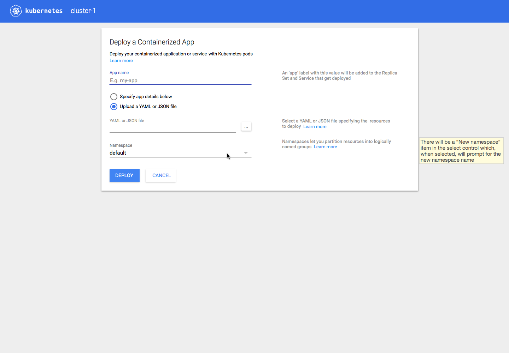
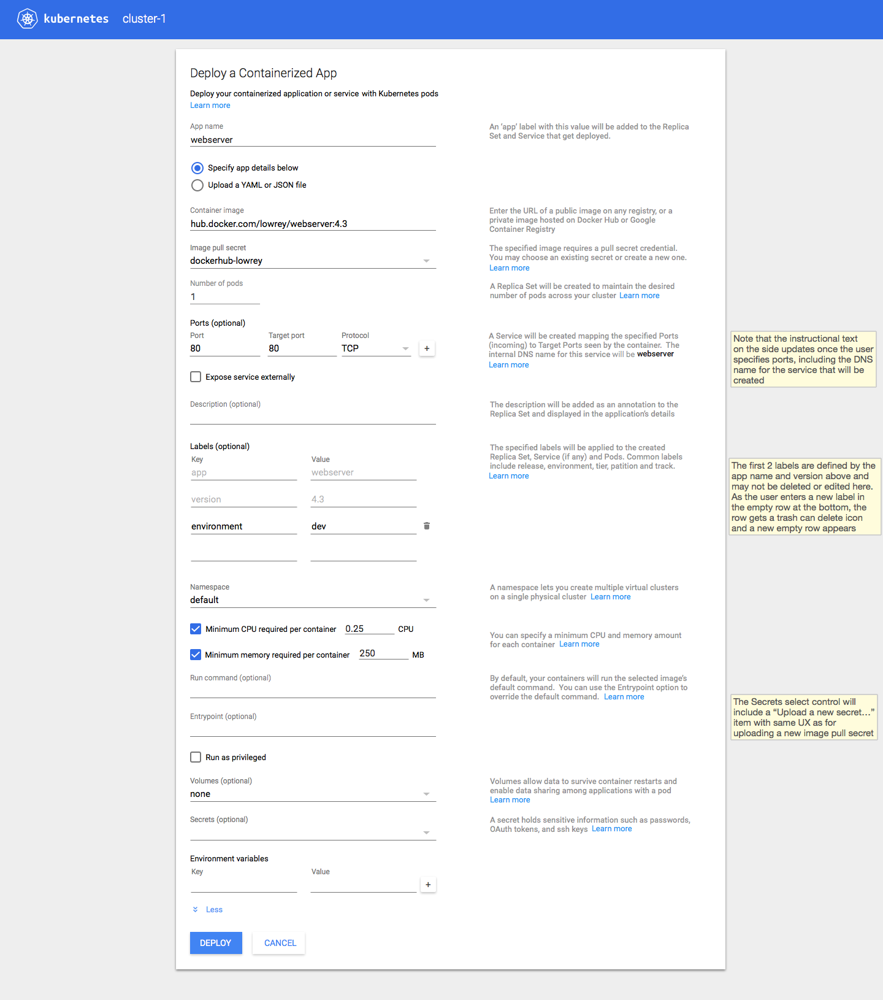
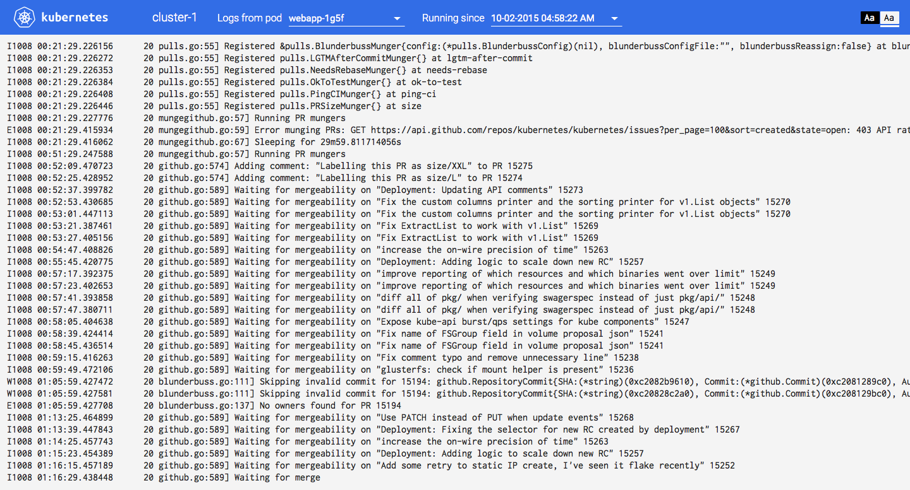

#Kubernetes Dashboard Design Mockups 11-11-2015

## Download Sketch File
[Dashboard Sketch File](kubernetes-dashboard.sketch) 

##Slides  
### Title
  
### Notes
 
### Welcome - Zero State
  
### Deploy from Upload
  
### Deploy form new namespace dialog
  
### Deploy form new namespace specified
  
### Deploy form new namespace
  
### Deploy form
  
### Deploy form image credentials required
  
### Deploy form pull secret menu with upload
  
### Deploy form pull secret upload
  
  
### Deploy form pull secret specified
  
### Deploy more
  
### Apps list
  
### Card variations
  
### Job detals
  
### Node hover
  
### Events
  
### Change pod count
  
### Logs current
  
### Logs running
  
### TBD for MVP
  
