# UX and navigation that scales

This design document is a proposal for Dashboard UI user experience that
covers navigation and the way of displaying and interacting with K8s objects.

## Background

Currently Dashboard UI allows users to see and interact with a very limited
subset of Kubernetes resources. For example, it shows Replication Controllers,
while ignoring existence of Replica Sets, Deployments, Daemon Sets, etc.
Additionally, it does not allow for creating or modifying individual
resources, while supporting only application creation (akin to `kubectl run`)
and scaling. For more details see [mockups](mockups/11-11-2015-initial) of
current implementation.

These limitations have been number one source of feature requests and
user complaints (e.g., #564, #524, #509, #510, #232). The core team also
considers solving these limitations as a natural evolution of the UI.

## Problem statement

* Scale the UX to support displaying and editing all current and future
  Kubernetes resources (e.g., replica sets, daemon sets, container, nodes,
  volumes, secrets, deployments, etc.).
* Scale for the number of objects displayed (currently: cards are suitable for
  O(20), desired: show any number of objects).
* Guide users through use-case based views (don't just do API dump).
* Make the UI aware of namespaces and multi-cluster installations.

# Design
The design is based on a few novelties to the UX of Kubernetes Dashboard. This
is:
* introduction of use-case based navigation menu and views
* replacement of free-form cards by tabularized resource lists
* being explicit about Kubernetes resources displayed in the UI
* introduction of action bar for performing all actions on resources

## Navigation
Navigation is realized by left hand side menu. The menu consists of use case
driven categories that group Kubernetes resources. For example, there may be
category called "Apps" which deals with Replication Controllers, Pods,
Deployments, etc., and "Config" which deals with Secrets, Volumes,
Namespaces, etc. The exact definition of categories will happen in a separate
design.

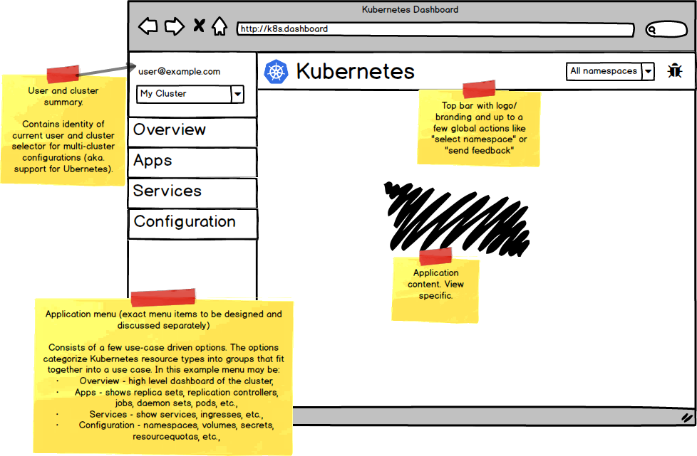

Menu categories may be expanded into raw resource subpages for expert users.

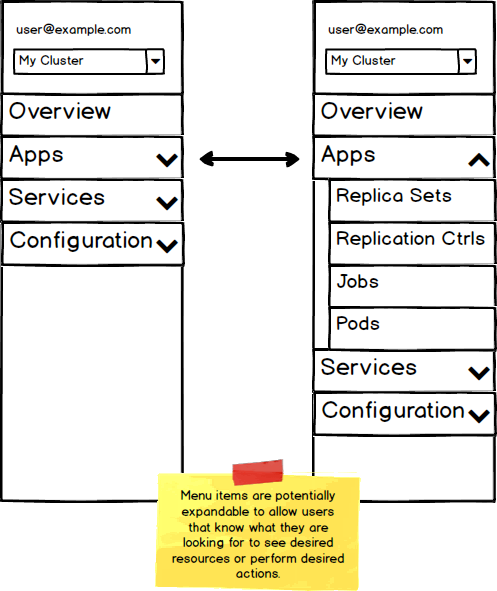

Menu follows standard responsiveness practises where it folds into icons and
hamburger menu when space is limited.

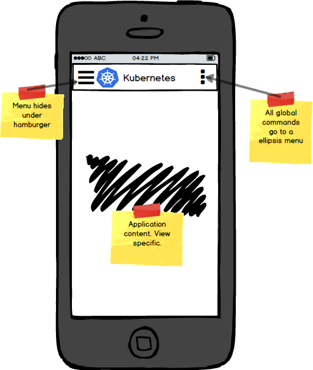

## View templates

This section shows concepts used as templates for all views.

View which does not deal with a resource or a resource list, e.g., landing
page which shows an overview of a cluster. The page consists of, potentially
dismissible, blocks that display data.
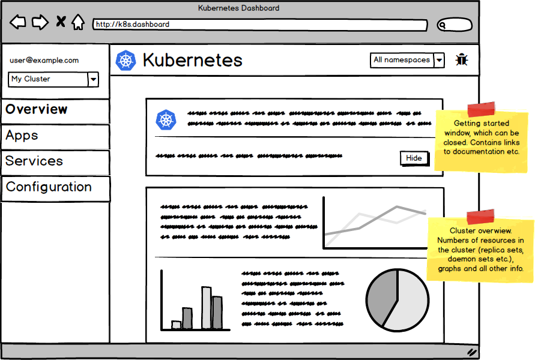

Category view which shows lists of resources. In this mockup it is
(not defined yet) "Apps" category which was selected through the
navigation menu.
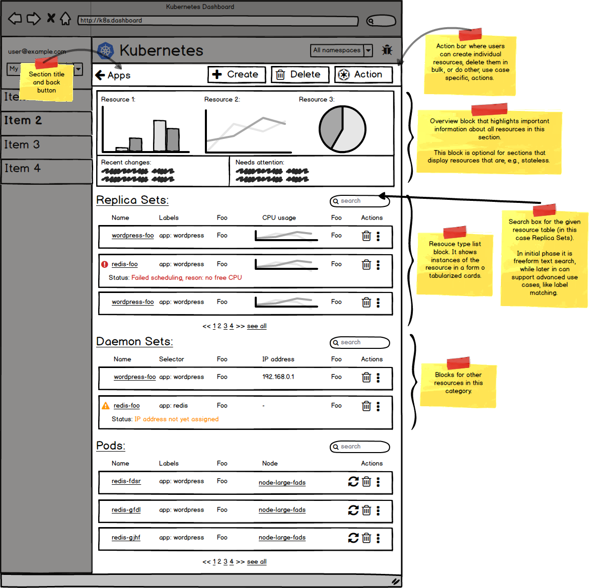

Action bar replaces floating action button. The reason for this change
is the fact that floating action buttons do not work well on desktop
form factors, which are used by vast majority of our users. On the other
hand, action bars work well on any form factors (desktop, mobile)
and can scale for different actions on different resources.
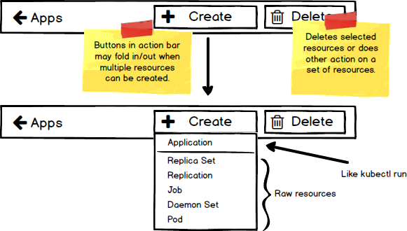

Details of the resource list block:
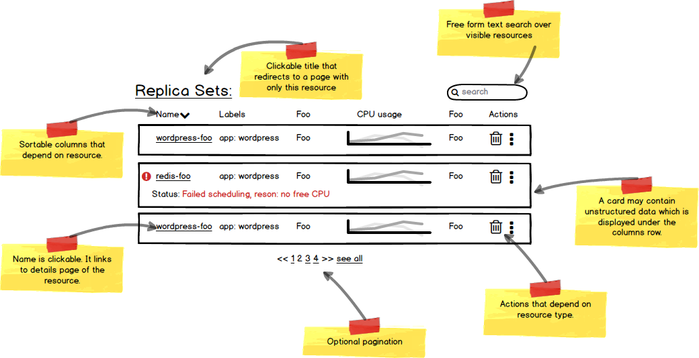

While the concept of cards used for displaying resources has some nice
characteristics (like information density) it has been a constant source of
problems. Users and developers complained about many issues: how do you sort
cards? how do you change their order? how do you paginate them? how do you
compare resources against each other? how do you distinct different resources
in a card stream? how do you do bulk operations?

We have identified that in order to solve these problems the cards can evolve
into tabularized list items which can show exactly the same information as
cards. This solution has many advantages, some of which are: pagination,
ordering, bulk actions or visual comparison. Following mockup outlines
the evolution:
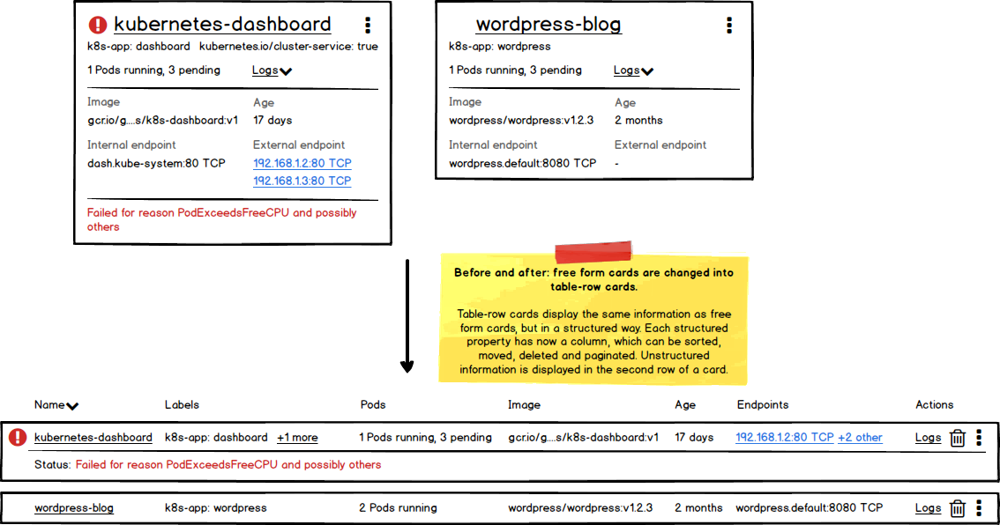

Category views link to single resource views which show an unbounded list
of resources of single type (e.g., Replica Sets) and a short summary/
call to action block.
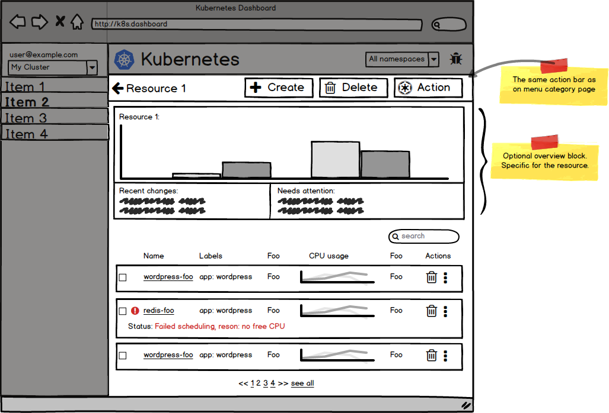

Details of an individual resource instance are shown on a views which displays
its properties and all related objects (e.g., Services that target a Pod).
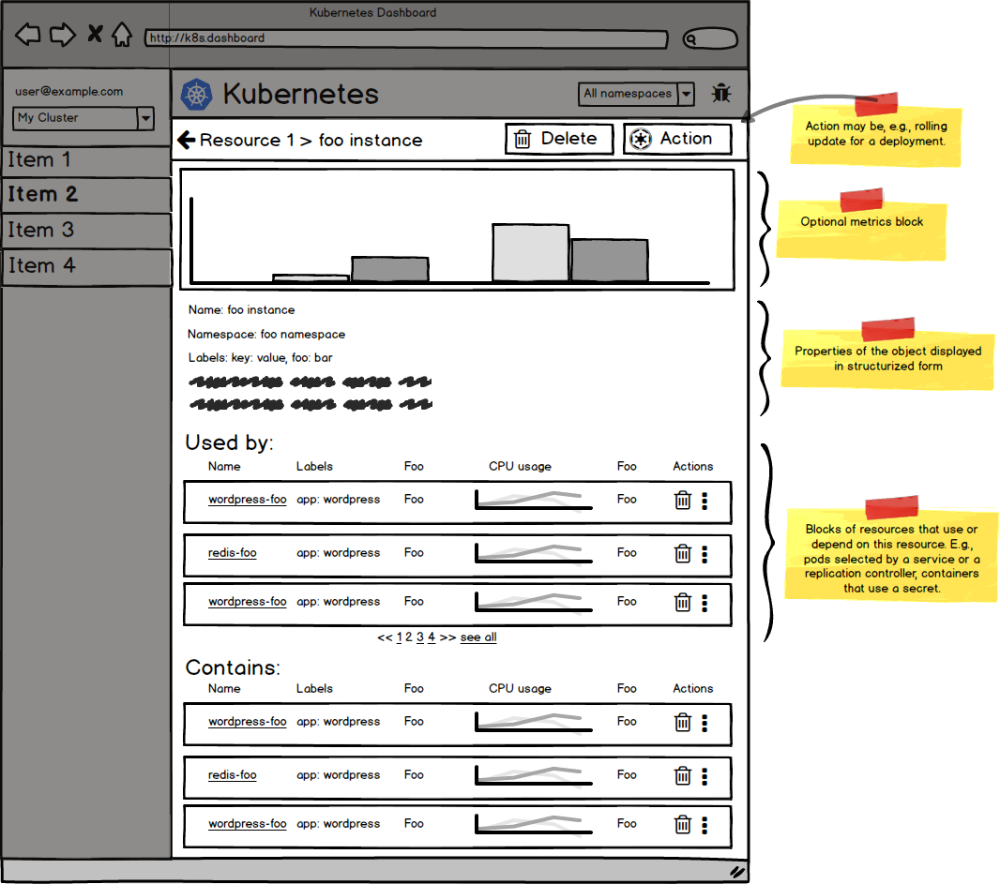

## Future work
* Make it possible to add/remove columns from resource lists. This is to
  accommodate different use cases and needs that different users have. This
  can be based on individual user's preference or their profiles. The profiles
  may be, e.g., "Debugging", "Release" or "Resource Management".
* Pivot labels into columns. For example, for every replica set in a list
  have a column named `env` which displays the value of this label
  (e.g., `dev`, `prod`, `test`). The pivot is user configurable.
* Design application menu categories. Tracked in
  https://github.com/kubernetes/kubernetes/issues/22687
* Design individual resource lists and detail pages (for, e.g., Pods, Services,
  Replica Sets, etc.)
* Advanced resource list filtering that supports label and field matching
* Better handling large number of resources: customized pagination and
  section collapsing.

## Concrete pages
This section shows how templates proposed in the "View templates" section
can be applied to real examples.

"Apps" category:

Replication Controller list under "Apps" category:
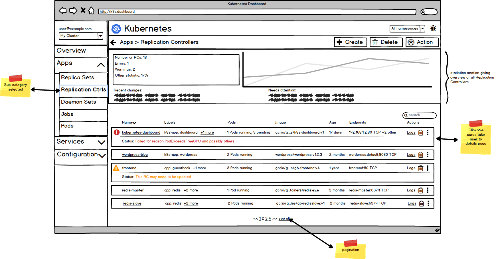

Pod details overview:

Pod details events:
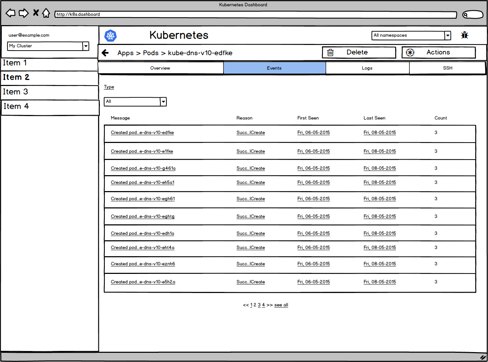

Pod details logs:
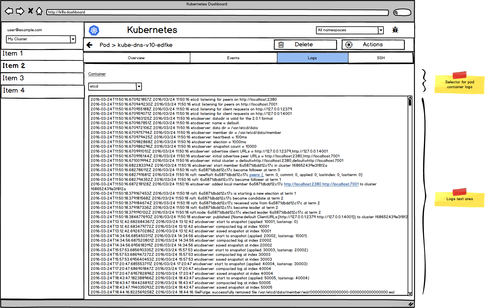

Pod details SSH tab:
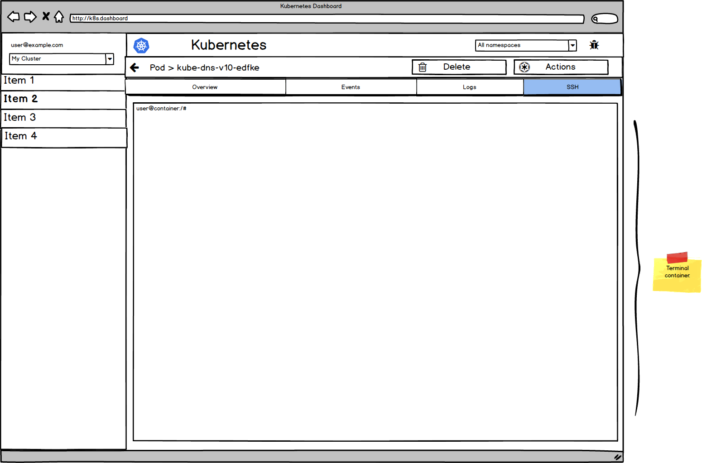

Replication Controller details overview:
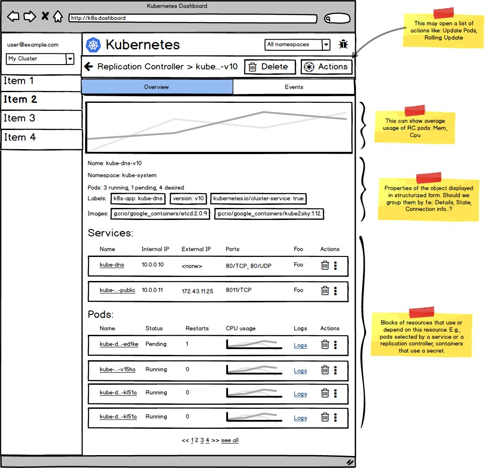

Replication Controller details events:
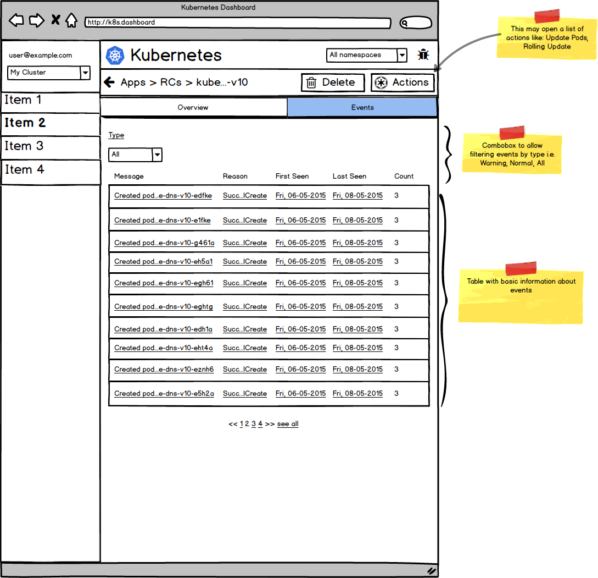

## Credits
[Source code](mockups/23-03-2016-scale-and-navigation/dashboard-scale-and-navigation.bmpr)
of the mockups.

Proposed by [@bryk](https://github.com/bryk),
[@cheld](https://github.com/cheld),
[@digitalfishpond](https://github.com/digitalfishpond),
[@floreks](https://github.com/floreks),
[@maciaszczykm](https://github.com/maciaszczykm),
[@olekzabl](https://github.com/olekzabl),
[@zreigz](https://github.com/zreigz) during 23-03-2016 design sprint day
([report](sprints/scale_ux_20160323.md)).
