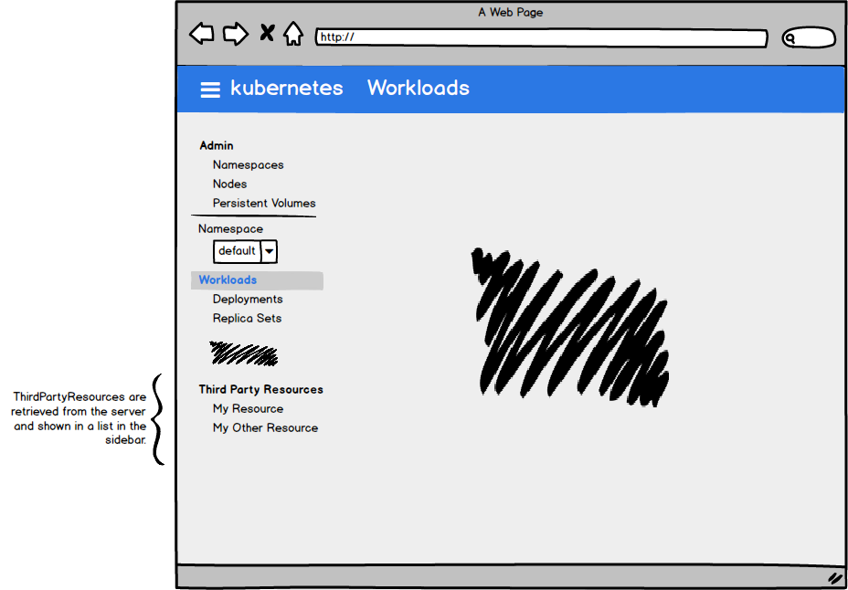
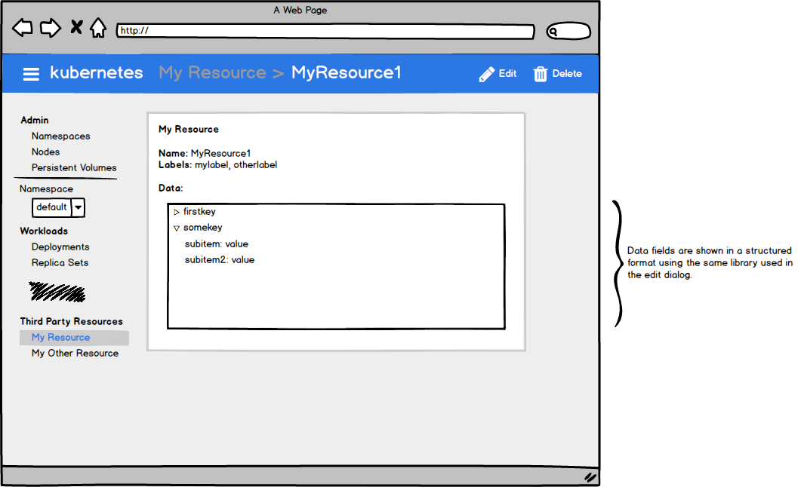

# Third Party Resources

This design document is a proposal for supporting Third Party Resources in Dashboard.

# Background

[Third Party
Resources](https://kubernetes.io/docs/user-guide/thirdpartyresources/) are a
special type of resource that allow end users to extend Kubernetes by adding
new object types each with it's own URL endpoint in the API. Third Party
Resources are often used in conjunction with custom controllers to provide
extra functionality.

Once a Third Party Resource is created it functions just like any other type in
Kubernetes. Individual objects for the new type can be created with arbitrary
JSON data.

# Problems statement

- Update the UI to be closer in feature parity to the CLI
- Support displaying and editing more Kubernetes resources by allowing users to view and edit Third Party Resources

# Design

Third Party Resources will be listed in the sidebar of the UI in a new section
alongside first party objects. It will function similarly to existing menu
items except that the items in the menu will be dynamically populated from the
server.

Clicking on a menu item brings up the Third Party Resource's detail page where
the details of the ThirdPartyResource itself is displayed and objects created
using that ThirdPartyResource are listed below.

Objects created as a Third Party Resource can contain arbitrary JSON data. It
is difficult to display the data in an intuitive way that captures the intended
use of the resource. It is proposed that the arbitrary JSON data be shown in an
structured tree format using the library currently used for the edit dialog. It
has been proposed to replace this library in the edit dialog however (#1221).

