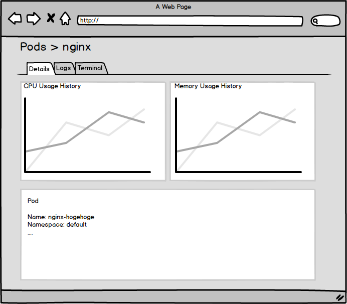
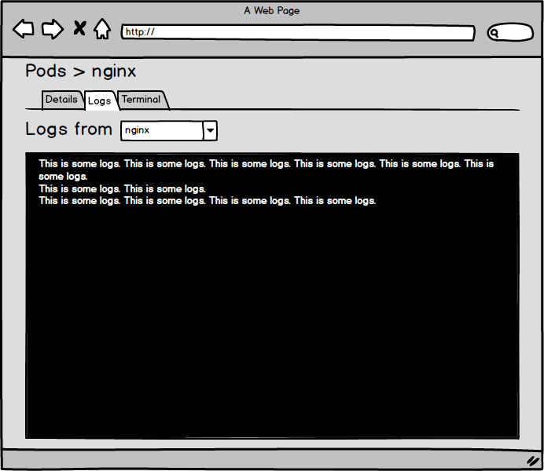
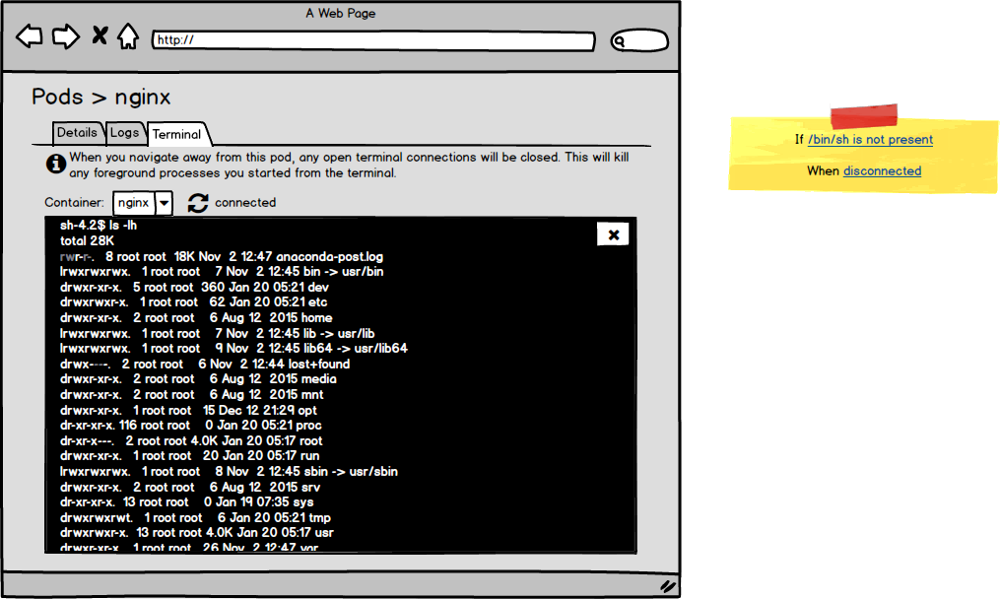
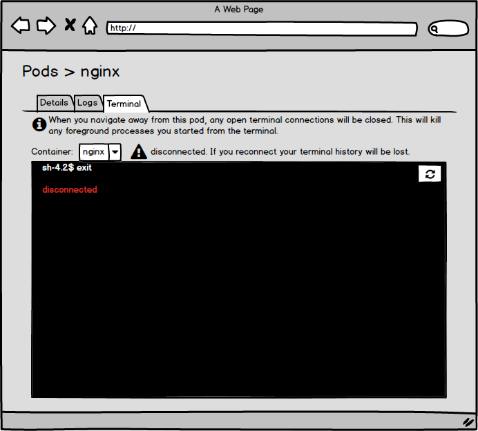
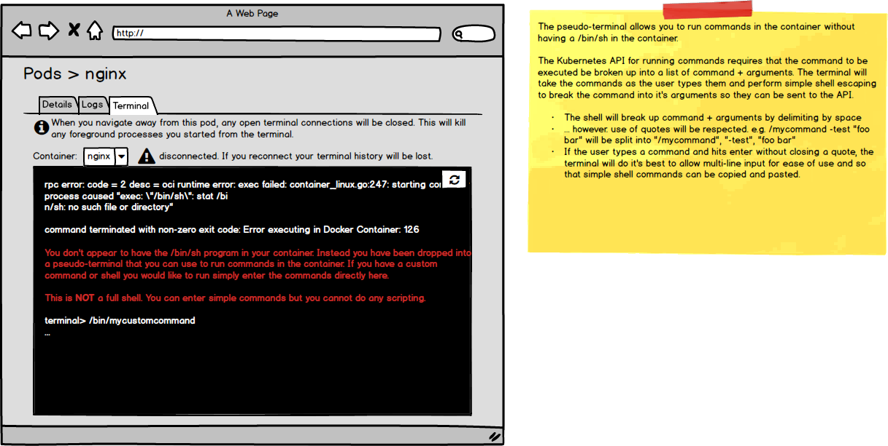
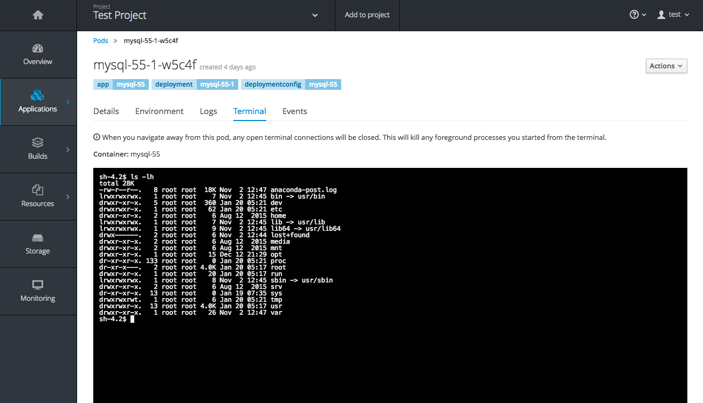
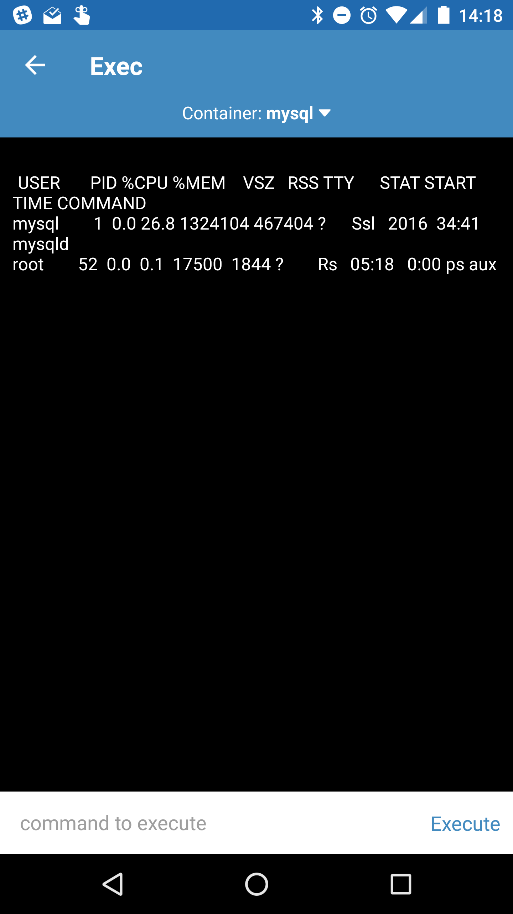

# Application Troubleshooting

This design document is a proposal to consolidate application troubleshooting features in Dashboard.

## Background

The Kubernetes command line interface has several features for inspecting applications running in Pods. Some examples are as follows.

- Viewing application logs (kubectl logs).
- Attaching to a running container (kubectl attach).
- Executing a process in a container and opening a terminal session (kubectl exec).
- Port forwarding to a container (kubectl port-forward).
- Creating a proxy to the Kubernetes API server (kubectl proxy).

Troubleshooting and debugging have consistently been a top priority from a user's point of view. See:

- [Kubernetes UI Survey Nov 2016](https://github.com/kubernetes/dashboard/blob/master/docs/images/kubecon-infographic-nov2016.png)
- [Kubernetes UI Survey Nov 2017](https://kubernetes.io/blog/2017/01/kubernetes-ux-survey-infographic/)

## Problem Statement

- Update the UI to allow easier troubleshooting of problem containers.
  - Allow users to execute arbitrary processes in containers.
  - Improve the UI so that troubleshooting functions are easier to find and use.
  - Attaching to the container process (e.g. kubectl attach) will be out of scope due to low priority. End users can solve most problems by viewing logs. 
  - Port forwarding and API server proxy will be out of scope due to low priority and technical issues.

## Use Cases

Use cases for opening a terminal session are numerous and highly application specific. The use cases are similar to use cases for opening an SSH session to a server.

Some generic use cases include but are not limited to:

- Verifying the contents of files.
  - Files in the container image.
  - Files written by a process in the container.
  - Files in mounted volumes (PersistentVolume, ConfigMap, Secret, etc.)
- Listing and verifying the state of processes.
- Running commands to verify the output of a process.
- Troubleshooting why a process is failing readiness or liveliness probes.
  - Connecting to and sending commands to processes to test their output.
  - Running probe commands to test their exit codes and output.
- Troubleshooting performance issues.
  - Verifying CPU/memory usage of processes.
    - Validating this against CPU/memory usage recorded by Kubernetes.
    - Comparing usage with CPU/memory limits imposed on the container.

## Design

The basis of the design is adding one new feature and updating the UI so that troubleshooting features are logically grouped.

- Terminal: Allow users to create a terminal session in a container from the UI.
- UI Improvements: Logically group Details, Logs, and Terminal to allow for smoother troubleshooting.

### UI Improvements

The UI will be improved to add tabs to a pod detail page. The tabs will include:

- Details
- Logs
- Terminal

End users can switch between the Details, Logs, and Terminal tabs without reloading the page. Users can switch tabs without ending an existing terminal session. This is important so that users can view logs or detailed pod information without losing their work in the terminal.

The "Details" tab is equivalent to the existing Pod details page. It includes "Details", "Containers", "Conditions", "Created by".

The Logs tab is equivalent to the existing Logs page.

### Terminal

The terminal will allow users to execute arbitrary commands inside a container. When a user switches to the Terminal tab for the first time, Dashboard will establish a terminal session. The terminal will attempt to run the standard '/bin/sh' shell command in the container. If '/bin/sh' is present and executable users can use it to execute arbitrary commands in the shell environment.

The terminal will allow the user to switch between containers in the pod. Dashboard will also show the status of the session. Dashboard will indicate when the user is disconnected and allow them to reconnect.

If the '/bin/sh' command is not present, the terminal will detect this and drop the user into a pseudo-terminal that runs in the browser. The pseudo-terminal allows users to run commands in the container without having '/bin/sh' installed.

.

The Kubernetes API for running commands requires the executed command to be in list format. The pseudo-terminal will take the commands as the user types them and perform simple shell escaping to break the full command into its arguments.
 
* The shell will split the full command into command + arguments by delimiting by space.
* ... however. use of quotes will be respected. e.g. /mycommand \-test "foo bar" will be split into "/mycommand", "-test", "foo bar"
* If the user types a command and hits enter without closing a quote, the terminal will do its best to allow multi-line input. This will make the terminal easier to use and allow simple shell commands to be copied and pasted.

#### Similar Features in Other UIs

Several other UIs have similar troubleshooting features.

##### OpenShift

The terminal feature was heavily influenced by the terminal feature in OpenShift. OpenShift's terminal runs the '/bin/sh' command automatically as outlined in this document, however it does not allow running of commands if the '/bin/sh' command is not present in the container.

##### Cabin

Cabin is a mobile application for interacting with a Kubernetes cluster. Cabin includes an exec feature that allows the user to execute commands in containers. Cabin allows the execution of commands but does not support running the command in a tty or piping stdin to the container.

