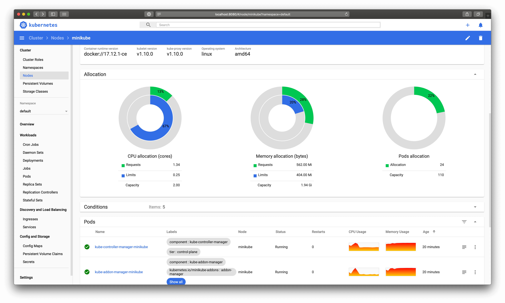

# Text conventions

Kubernetes Dashboard is a web-based user interface for Kubernetes clusters. It consists of multiple views like overview pages, list of resources and resource details pages. Much textual information is required within these elements. Let's consider sample dialog:

As you noticed there are a lot of different kinds of text messages in each view:

* Titles.
* Headers.
* Labels.
* Values.
* Tooltips.
* Action button.
* Menu and navigation entries.
* All kinds of messages including warnings, errors and help information.

For each one of them a developer has to make the following decisions:

* Grammar - Using a verb in infinitive or gerund form?
* Punctuation - Using a period or not?
* Capitalization - Using capitalized words? Capitalize Kubernetes specific names?

In addition, with few exceptions, all text messages within the Dashboard should be localized. For more details check our [internationalization guidelines](internationalization.md)).

## General terms

### Grammar

The gerund form should be used everywhere. Exceptions are all kinds of messages including warnings, errors and help information.

### Punctuation

Certain types of text resources should have punctuation. Periods should be used for

* All kinds of messages including warnings, errors and help information.

Periods should be avoided for:

* Headers.
* Titles.
* Labels.
* Values.
* Tooltips.
* Menu and navigation entries.

### Capitalization

In general, all kinds of messages should have their first word capitalized. Exceptions are:

* Names which appear in the middle of a message.
* Values and table contents.

Moreover, Kubernetes-specific names should be capitalized everywhere. This includes:

* Application names - Kubernetes, Kubernetes Dashboard etc.
* Resource names - Pod, Service, Endpoint, Node etc.

----
_Copyright 2019 [The Kubernetes Dashboard Authors](https://github.com/kubernetes/dashboard/graphs/contributors)_
