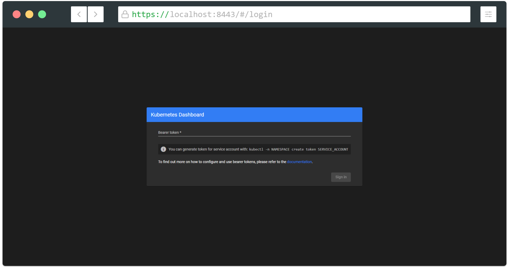
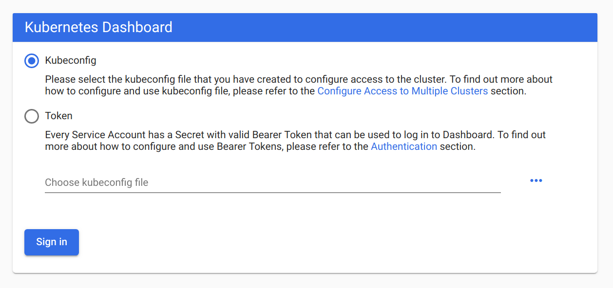

# Access control

Once Dashboard is installed and accessible we can focus on configuring access control to the cluster resources for users.

## Introduction

Kubernetes supports few ways of authenticating and authorizing users.
You can read about them [here](https://kubernetes.io/docs/reference/access-authn-authz/authentication/) and
[here](https://kubernetes.io/docs/reference/access-authn-authz/authorization/). Authorization is handled by Kubernetes API server.
Dashboard only acts as a proxy and passes all auth information to it. In case of forbidden access corresponding warnings will be displayed in Dashboard.

## Default Dashboard privileges

* `get`, `update` and `delete` permissions for Secrets named `kubernetes-dashboard-key-holder`, `kubernetes-dashboard-certs` and `kubernetes-dashboard-csrf` in `kubernetes-dashboard` namespace.
* `get` and `update` permissions for the Config Map named `kubernetes-dashboard-settings` in `kubernetes-dashboard` namespace.
* `get` permission for `services/proxy` in order to allow `heapster` and `dashboard-metrics-scraper` services in `kubernetes-dashboard` namespace required to gather metrics.
* `get`, `list` and `watch` permissions for `metrics.k8s.io` API in order to allow `dashboard-metrics-scraper` to gather metrics from the `metrics-server`.

## Authentication

Kubernetes Dashboard supports a few different ways of authenticating users:

* [Authorization header](#authorization-header) passed in every request to Dashboard. Supported from release 1.6. Has the highest priority. If present, login view will be skipped.
* [Bearer Token](#bearer-token) that can be used on Dashboard [login view](#login-view).
* [Username/password](#basic) that can be used on Dashboard [login view](#login-view).
* [Kubeconfig](#kubeconfig) file that can be used on Dashboard [login view](#login-view).

### Login view

In case you are using the latest recommended installation then login functionality will be enabled by default. In any other case and if you prefer to configure certificates manually you need to pass `--tls-cert-file` and `--tls-cert-key` flags to Dashboard. HTTPS endpoint will be exposed on port `8443` of Dashboard container. You can change it by providing `--port` flag.

Using `Skip` option will make Dashboard use privileges of Service Account used by Dashboard. `Skip` button is disabled by default since 1.10.1. Use `--enable-skip-login` dashboard flag to display it.



### Authorization header

Using authorization header is the only way to make Dashboard act as an user, when accessing it over HTTP. Note that there are some risks since plain HTTP traffic is vulnerable to [MITM attacks](https://en.wikipedia.org/wiki/Man-in-the-middle_attack).

To make Dashboard use authorization header you simply need to pass `Authorization: Bearer <token>` in every request to Dashboard. This can be achieved i.e. by configuring reverse proxy in front of Dashboard. Proxy will be responsible for authentication with identity provider and will pass generated token in request header to Dashboard. Note that Kubernetes API server needs to be configured properly to accept these tokens.

To quickly test it check out [Requestly](https://chrome.google.com/webstore/detail/requestly-redirect-url-mo/mdnleldcmiljblolnjhpnblkcekpdkpa) Chrome browser plugin that allows to manually modify request headers.

**IMPORTANT:** Authorization header will not work if Dashboard is accessed through API server proxy. Both `kubectl proxy` and `API Server` way of accessing Dashboard described in [Accessing Dashboard](../accessing-dashboard/README.md) guide will not work. It is due to the fact that once request reaches API server all additional headers are dropped.

### Bearer Token

It is recommended to get familiar with [Kubernetes authentication](https://kubernetes.io/docs/reference/access-authn-authz/authentication/) documentation first to find out how to get token, that can be used to login. In example every Service Account has a Secret with valid Bearer Token that can be used to login to Dashboard.

Recommended lecture to find out how to create Service Account and grant it privileges:

* [Service Account Tokens](https://kubernetes.io/docs/reference/access-authn-authz/authentication/#service-account-tokens)
* [Role and ClusterRole](https://kubernetes.io/docs/reference/access-authn-authz/rbac/#role-and-clusterrole)
* [Service Account Permissions](https://kubernetes.io/docs/reference/access-authn-authz/rbac/#service-account-permissions)

To create sample user and to get its token, see [Creating sample user](./creating-sample-user.md) guide.

### Basic
Basic authentication is disabled by default. The reason is that Kubernetes API server needs to be configured with authorization mode ABAC and `--basic-auth-file` flag provided. Without that API server automatically falls back to [anonymous user](https://kubernetes.io/docs/reference/access-authn-authz/authentication/#anonymous-requests) and there is no way to check if provided credentials are valid.

In order to enable basic auth in Dashboard `--authentication-mode=basic` flag has to be provided. By default it is set to `--authentication-mode=token`.

Note: Basic authentication with `--basic-auth-file` has been deprecated since Kubernetes v1.19. For similar functionality to `--basic-auth-file` flag, use `--token-auth-file`  with [Static Token File](https://kubernetes.io/docs/reference/access-authn-authz/authentication/#static-token-file).

### Kubeconfig

This method of logging in is provided for convenience. Only authentication options specified by `--authentication-mode` flag are supported in kubeconfig file. In case it is configured to use any other way, error will be shown in Dashboard. External identity providers or certificate-based authentication are not supported at this time.



## Admin privileges

**IMPORTANT:** Make sure that you know what you are doing before proceeding. Granting admin privileges to Dashboard's Service Account might be a security risk.

You can grant full admin privileges to Dashboard's Service Account by creating below `ClusterRoleBinding`. Copy the YAML file based on chosen installation method and save as, i.e. `dashboard-admin.yaml`. Use `kubectl create -f dashboard-admin.yaml` to deploy it. Afterwards you can use `Skip` option on login page to access Dashboard.

### Official release

```yaml
apiVersion: rbac.authorization.k8s.io/v1
kind: ClusterRoleBinding
metadata:
  name: kubernetes-dashboard
  namespace: kubernetes-dashboard
roleRef:
  apiGroup: rbac.authorization.k8s.io
  kind: ClusterRole
  name: cluster-admin
subjects:
  - kind: ServiceAccount
    name: kubernetes-dashboard
    namespace: kubernetes-dashboard
```

### Development release

```yaml
apiVersion: rbac.authorization.k8s.io/v1
kind: ClusterRoleBinding
metadata:
  name: kubernetes-dashboard-head
  namespace: kubernetes-dashboard-head
roleRef:
  apiGroup: rbac.authorization.k8s.io
  kind: ClusterRole
  name: cluster-admin
subjects:
  - kind: ServiceAccount
    name: kubernetes-dashboard-head
    namespace: kubernetes-dashboard-head
```

----
_Copyright 2019 [The Kubernetes Dashboard Authors](https://github.com/kubernetes/dashboard/graphs/contributors)_
