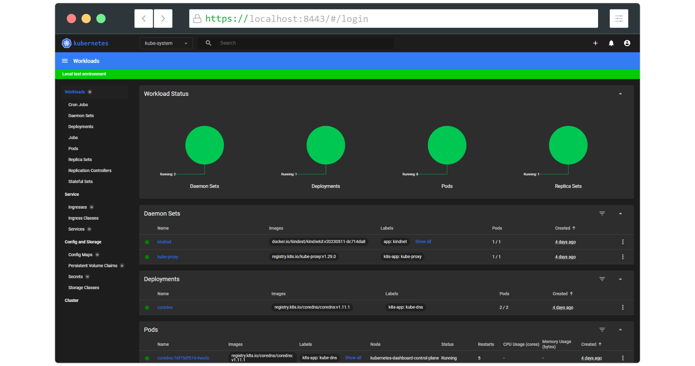

# Creating sample user

In this guide, we will find out how to create a new user using the Service Account mechanism of Kubernetes, grant this user admin permissions and login to Dashboard using a bearer token tied to this user.

**IMPORTANT:** Make sure that you know what you are doing before proceeding. Granting admin privileges to Dashboard's Service Account might be a security risk.

For each of the following snippets for `ServiceAccount` and `ClusterRoleBinding`, you should copy them to new manifest files like `dashboard-adminuser.yaml` and use `kubectl apply -f dashboard-adminuser.yaml` to create them.

## Creating a Service Account

We are creating Service Account with the name `admin-user` in namespace `kubernetes-dashboard` first.

```yaml
apiVersion: v1
kind: ServiceAccount
metadata:
  name: admin-user
  namespace: kubernetes-dashboard
```

## Creating a ClusterRoleBinding

In most cases after provisioning the cluster using `kops`, `kubeadm` or any other popular tool, the `ClusterRole` `cluster-admin` already exists in the cluster. We can use it and create only a `ClusterRoleBinding` for our `ServiceAccount`.
If it does not exist then you need to create this role first and grant required privileges manually.

```yaml
apiVersion: rbac.authorization.k8s.io/v1
kind: ClusterRoleBinding
metadata:
  name: admin-user
roleRef:
  apiGroup: rbac.authorization.k8s.io
  kind: ClusterRole
  name: cluster-admin
subjects:
- kind: ServiceAccount
  name: admin-user
  namespace: kubernetes-dashboard
```

## Getting a Bearer Token

Now we need to find the token we can use to log in. Execute the following command:

```shell
kubectl -n kubernetes-dashboard get secret $(kubectl -n kubernetes-dashboard get sa/admin-user -o jsonpath="{.secrets[0].name}") -o go-template="{{.data.token | base64decode}}"
```

It should print something like:

```
eyJhbGciOiJSUzI1NiIsImtpZCI6IiJ9.eyJpc3MiOiJrdWJlcm5ldGVzL3NlcnZpY2VhY2NvdW50Iiwia3ViZXJuZXRlcy5pby9zZXJ2aWNlYWNjb3VudC9uYW1lc3BhY2UiOiJrdWJlcm5ldGVzLWRhc2hib2FyZCIsImt1YmVybmV0ZXMuaW8vc2VydmljZWFjY291bnQvc2VjcmV0Lm5hbWUiOiJhZG1pbi11c2VyLXRva2VuLXY1N253Iiwia3ViZXJuZXRlcy5pby9zZXJ2aWNlYWNjb3VudC9zZXJ2aWNlLWFjY291bnQubmFtZSI6ImFkbWluLXVzZXIiLCJrdWJlcm5ldGVzLmlvL3NlcnZpY2VhY2NvdW50L3NlcnZpY2UtYWNjb3VudC51aWQiOiIwMzAzMjQzYy00MDQwLTRhNTgtOGE0Ny04NDllZTliYTc5YzEiLCJzdWIiOiJzeXN0ZW06c2VydmljZWFjY291bnQ6a3ViZXJuZXRlcy1kYXNoYm9hcmQ6YWRtaW4tdXNlciJ9.Z2JrQlitASVwWbc-s6deLRFVk5DWD3P_vjUFXsqVSY10pbjFLG4njoZwh8p3tLxnX_VBsr7_6bwxhWSYChp9hwxznemD5x5HLtjb16kI9Z7yFWLtohzkTwuFbqmQaMoget_nYcQBUC5fDmBHRfFvNKePh_vSSb2h_aYXa8GV5AcfPQpY7r461itme1EXHQJqv-SN-zUnguDguCTjD80pFZ_CmnSE1z9QdMHPB8hoB4V68gtswR1VLa6mSYdgPwCHauuOobojALSaMc3RH7MmFUumAgguhqAkX3Omqd3rJbYOMRuMjhANqd08piDC3aIabINX6gP5-Tuuw2svnV6NYQ
```

Now copy the token and paste it into the `Enter token` field on the login screen.


Click the `Sign in` button and that's it. You are now logged in as an admin.



## Clean up and next steps

Remove the admin `ServiceAccount` and `ClusterRoleBinding`.

```shell
kubectl -n kubernetes-dashboard delete serviceaccount admin-user
kubectl -n kubernetes-dashboard delete clusterrolebinding admin-user
```

In order to find out more about how to grant/deny permissions in Kubernetes read the official [authentication](https://kubernetes.io/docs/reference/access-authn-authz/authentication/) & [authorization](https://kubernetes.io/docs/reference/access-authn-authz/authorization/) documentation.

----
_Copyright 2020 [The Kubernetes Dashboard Authors](https://github.com/kubernetes/dashboard/graphs/contributors)_
