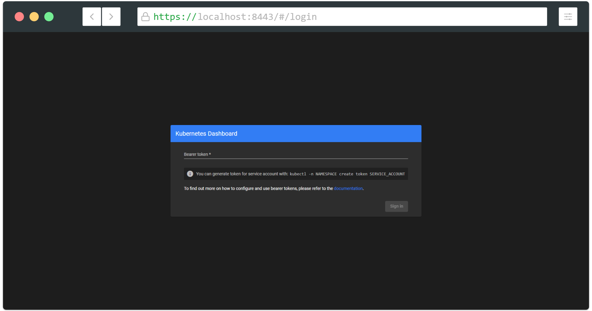

# Creating sample user

In this guide, we will find out how to create a new user using Service Account mechanism of Kubernetes, grant this user admin permissions and login to Dashboard using bearer token tied to this user.

**IMPORTANT:** Make sure that you know what you are doing before proceeding. Granting admin privileges to Dashboard's Service Account might be a security risk.

For each of the following snippets for `ServiceAccount` and `ClusterRoleBinding`, you should copy them to new manifest files like `dashboard-adminuser.yaml` and use `kubectl apply -f dashboard-adminuser.yaml` to create them.

## Creating a Service Account

We are creating Service Account with name `admin-user` in namespace `kubernetes-dashboard` first.

```
apiVersion: v1
kind: ServiceAccount
metadata:
  name: admin-user
  namespace: kubernetes-dashboard
```

## Creating a ClusterRoleBinding

In most cases after provisioning cluster using `kops`, `kubeadm` or any other popular tool, the `ClusterRole` `cluster-admin` already exists in the cluster. We can use it and create only `ClusterRoleBinding` for our `ServiceAccount`.
If it does not exist then you need to create this role first and grant required privileges manually.

**NOTE:** `apiVersion` of `ClusterRoleBinding` resource may differ between Kubernetes versions. Prior to Kubernetes `v1.8` the `apiVersion` was `rbac.authorization.k8s.io/v1beta1`.

```
apiVersion: rbac.authorization.k8s.io/v1
kind: ClusterRoleBinding
metadata:
  name: admin-user
roleRef:
  apiGroup: rbac.authorization.k8s.io
  kind: ClusterRole
  name: cluster-admin
subjects:
- kind: ServiceAccount
  name: admin-user
  namespace: kubernetes-dashboard
```

## Getting a Bearer Token

Now we need to find token we can use to log in. Execute following command:

For Bash:

```bash
kubectl -n kubernetes-dashboard describe secret $(kubectl -n kubernetes-dashboard get secret | grep admin-user | awk '{print $1}')
```

For Powershell:
```powershell
kubectl -n kubernetes-dashboard describe secret $(kubectl -n kubernetes-dashboard get secret | sls admin-user | ForEach-Object { $_ -Split '\s+' } | Select -First 1)
```

It should print something like:

```
Name:         admin-user-token-v57nw
Namespace:    kubernetes-dashboard
Labels:       <none>
Annotations:  kubernetes.io/service-account.name: admin-user
              kubernetes.io/service-account.uid: 0303243c-4040-4a58-8a47-849ee9ba79c1

Type:  kubernetes.io/service-account-token

Data
====
ca.crt:     1066 bytes
namespace:  20 bytes
token:      eyJhbGciOiJSUzI1NiIsImtpZCI6IiJ9.eyJpc3MiOiJrdWJlcm5ldGVzL3NlcnZpY2VhY2NvdW50Iiwia3ViZXJuZXRlcy5pby9zZXJ2aWNlYWNjb3VudC9uYW1lc3BhY2UiOiJrdWJlcm5ldGVzLWRhc2hib2FyZCIsImt1YmVybmV0ZXMuaW8vc2VydmljZWFjY291bnQvc2VjcmV0Lm5hbWUiOiJhZG1pbi11c2VyLXRva2VuLXY1N253Iiwia3ViZXJuZXRlcy5pby9zZXJ2aWNlYWNjb3VudC9zZXJ2aWNlLWFjY291bnQubmFtZSI6ImFkbWluLXVzZXIiLCJrdWJlcm5ldGVzLmlvL3NlcnZpY2VhY2NvdW50L3NlcnZpY2UtYWNjb3VudC51aWQiOiIwMzAzMjQzYy00MDQwLTRhNTgtOGE0Ny04NDllZTliYTc5YzEiLCJzdWIiOiJzeXN0ZW06c2VydmljZWFjY291bnQ6a3ViZXJuZXRlcy1kYXNoYm9hcmQ6YWRtaW4tdXNlciJ9.Z2JrQlitASVwWbc-s6deLRFVk5DWD3P_vjUFXsqVSY10pbjFLG4njoZwh8p3tLxnX_VBsr7_6bwxhWSYChp9hwxznemD5x5HLtjb16kI9Z7yFWLtohzkTwuFbqmQaMoget_nYcQBUC5fDmBHRfFvNKePh_vSSb2h_aYXa8GV5AcfPQpY7r461itme1EXHQJqv-SN-zUnguDguCTjD80pFZ_CmnSE1z9QdMHPB8hoB4V68gtswR1VLa6mSYdgPwCHauuOobojALSaMc3RH7MmFUumAgguhqAkX3Omqd3rJbYOMRuMjhANqd08piDC3aIabINX6gP5-Tuuw2svnV6NYQ
```

Now copy the token and paste it into `Enter token` field on the login screen.



Click `Sign in` button and that's it. You are now logged in as an admin.


In order to find out more about how to grant/deny permissions in Kubernetes read official [authentication](https://kubernetes.io/docs/reference/access-authn-authz/authentication/) & [authorization](https://kubernetes.io/docs/reference/access-authn-authz/authorization/) documentation.

----
_Copyright 2019 [The Kubernetes Dashboard Authors](https://github.com/kubernetes/dashboard/graphs/contributors)_
