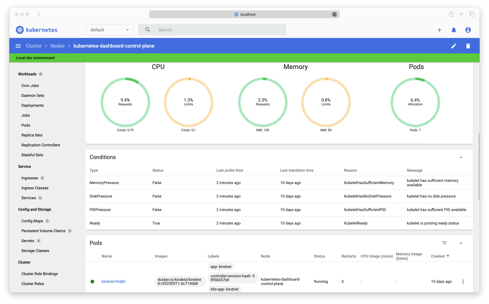

# Creating a Sample User

This guide explains how to create a new user in Kubernetes using a Service Account, grant that user admin privileges, and log in to the Dashboard using a bearer token.

For each of the following `ServiceAccount` and `ClusterRoleBinding` configurations, copy the content into a manifest file (e.g., `dashboard-adminuser.yaml`) and apply it using:

```bash
kubectl apply -f dashboard-adminuser.yaml
````

---

## Creating a Service Account

First, create a Service Account named `admin-user` in the `kubernetes-dashboard` namespace:

```yaml
apiVersion: v1
kind: ServiceAccount
metadata:
  name: admin-user
  namespace: kubernetes-dashboard
```
```

---

## Creating a ClusterRoleBinding

In most cases, when provisioning the cluster using tools like `kops`, `kubeadm`, or others, the `cluster-admin` ClusterRole already exists. You can bind it to the Service Account by creating the following `ClusterRoleBinding`:

```yaml
apiVersion: rbac.authorization.k8s.io/v1
kind: ClusterRoleBinding
metadata:
  name: admin-user
roleRef:
  apiGroup: rbac.authorization.k8s.io
  kind: ClusterRole
  name: cluster-admin
subjects:
- kind: ServiceAccount
  name: admin-user
  namespace: kubernetes-dashboard
```


> 📝 If the `cluster-admin` role does not exist in your cluster, you must create it manually and assign the required privileges.

---

## Getting a Bearer Token for the Service Account

To retrieve the token associated with the `admin-user` Service Account for logging in to the Dashboard, run the following command:

```bash
kubectl -n kubernetes-dashboard create token admin-user
```

This will output a token similar to:

```
eyJhbGciOiJSUzI1NiIsImtpZCI6IiJ9...
```

Refer to the [Kubernetes documentation](https://kubernetes.io/docs/tasks/configure-pod-container/configure-service-account/#manually-create-an-api-token-for-a-serviceaccount) for more information about ServiceAccount tokens.

---

## Creating a Long-Lived Bearer Token

Alternatively, you can manually create a long-lived token by defining a `Secret` bound to the Service Account. This ensures the token persists for a longer duration.

```yaml
apiVersion: v1
kind: Secret
metadata:
  name: admin-user
  namespace: kubernetes-dashboard
  annotations:
    kubernetes.io/service-account.name: "admin-user"
type: kubernetes.io/service-account-token
```

After creating the secret, run the following command to extract the token:

```bash
kubectl get secret admin-user -n kubernetes-dashboard -o jsonpath="{.data.token}" | base64 -d
```

Refer to the [Kubernetes documentation](https://kubernetes.io/docs/tasks/configure-pod-container/configure-service-account/#manually-create-a-long-lived-api-token-for-a-serviceaccount) for more details on long-lived tokens.

---

## Logging in to the Kubernetes Dashboard

Copy the token and paste it into the `Enter token` field on the login screen:


Click the `Sign in` button, and you’ll be logged in as an admin user.

> ⚠️ **Note:** Token login is only allowed when accessing the Dashboard via **HTTPS**. If accessed through **HTTP**, login will fail with an "invalid token" error.



---

## Clean Up

Once you're done, you can delete the admin user and role binding:

```bash
kubectl -n kubernetes-dashboard delete serviceaccount admin-user
kubectl -n kubernetes-dashboard delete clusterrolebinding admin-user
```

---

## Further Reading

For more information on authentication and authorization in Kubernetes, check out the official documentation:

* [Authentication](https://kubernetes.io/docs/reference/access-authn-authz/authentication/)
* [Authorization](https://kubernetes.io/docs/reference/access-authn-authz/authorization/)

---

© 2020 [The Kubernetes Dashboard Authors](https://github.com/kubernetes/dashboard/graphs/contributors)

```