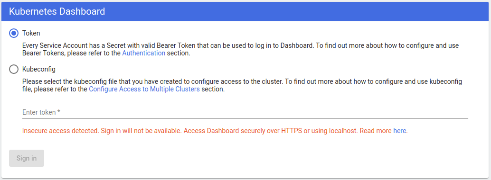

# Accessing Dashboard

Once Dashboard has been installed in your cluster it can be accessed in a few different ways. Note that this document does not describe all possible ways of accessing cluster applications.
In case of any error while trying to access Dashboard, please first read our [FAQ](../../common/faq.md) and check [closed issues](https://github.com/kubernetes/dashboard/issues?q=is%3Aissue+is%3Aclosed).
In most cases errors are caused by cluster configuration issues.

## Introduction
This document only describes the basic ways of accessing Kubernetes Dashboard [Recommended Setup](../installation.md#recommended-setup) deployment. It will also work if you have used recommended setup
with your custom certificates. If you have decided to follow the [Alternative Setup](../installation.md#alternative-setup) path, then the only difference is that instead of exposing Dashboard over HTTPS, it is exposed over HTTP by default.
As the alternative setup is recommended for advanced users only, we'll not describe in detail how to use it here.

## `kubectl proxy`

`kubectl proxy` creates a proxy server between your machine and Kubernetes API server. By default, it is only accessible locally (from the machine that started it).

First let's check if `kubectl` is properly configured and has access to the cluster. In case of error follow [this guide](https://kubernetes.io/docs/tasks/tools/install-kubectl/) to install and set up `kubectl`.

```shell
kubectl cluster-info
```

The output is similar to this:

```
Kubernetes master is running at https://192.168.30.148:6443
KubeDNS is running at https://192.168.30.148:6443/api/v1/namespaces/kube-system/services/kube-dns/proxy

To further debug and diagnose cluster problems, use 'kubectl cluster-info dump'.
```

Start local proxy server.

```shell
kubectl proxy
```

The output is similar to this:

```
Starting to serve on 127.0.0.1:8001
```

Once the proxy server has been started you should be able to access Dashboard from your browser.

To access the HTTPS endpoint of dashboard go to:
```bash
http://localhost:8001/api/v1/namespaces/kubernetes-dashboard/services/https:kubernetes-dashboard:/proxy/
```

## `kubectl port-forward`

Instead of `kubectl proxy`, you can use `kubectl port-forward` and access dashboard with simpler URL than using `kubectl proxy`.

```shell
kubectl port-forward -n kubernetes-dashboard service/kubernetes-dashboard 8080:443
```

To access Kubernetes Dashboard go to:
```shell
https://localhost:8080
```

## NodePort

This way of accessing Dashboard is only recommended for development environments in a single node setup.

Edit `kubernetes-dashboard` service.

```shell
kubectl -n kubernetes-dashboard edit service kubernetes-dashboard
```

You should see `yaml` representation of the service. Change `type: ClusterIP` to `type: NodePort` and save file. If it's already changed go to next step.

```yaml
# Please edit the object below. Lines beginning with a '#' will be ignored,
# and an empty file will abort the edit. If an error occurs while saving this file will be
# reopened with the relevant failures.
#
apiVersion: v1
...
  name: kubernetes-dashboard
  namespace: kubernetes-dashboard
  resourceVersion: "343478"
  selfLink: /api/v1/namespaces/kubernetes-dashboard/services/kubernetes-dashboard
  uid: 8e48f478-993d-11e7-87e0-901b0e532516
spec:
  clusterIP: 10.100.124.90
  externalTrafficPolicy: Cluster
  ports:
  - port: 443
    protocol: TCP
    targetPort: 8443
  selector:
    k8s-app: kubernetes-dashboard
  sessionAffinity: None
  type: ClusterIP
status:
  loadBalancer: {}
```

Next we need to check port on which Dashboard was exposed.

```shell
kubectl -n kubernetes-dashboard get service kubernetes-dashboard
```

The output is similar to this:

```
NAME                   TYPE       CLUSTER-IP       EXTERNAL-IP   PORT(S)        AGE
kubernetes-dashboard   NodePort   10.100.124.90   <nodes>       443:31707/TCP   21h
```

Dashboard has been exposed on port `31707 (HTTPS)`. Now you can access it from your browser at: `https://<master-ip>:31707`. `master-ip` can be found by executing `kubectl cluster-info`. Usually it is either `127.0.0.1` or IP of your machine, assuming that your cluster is running directly on the machine, on which these commands are executed.

In case you are trying to expose Dashboard using `NodePort` on a multi-node cluster, then you have to find out IP of the node on which Dashboard is running to access it. Instead of accessing `https://<master-ip>:<nodePort>` you should access `https://<node-ip>:<nodePort>`.

## API Server

In case Kubernetes API server is exposed and accessible from outside you can directly access dashboard at: `https://<master-ip>:<apiserver-port>/api/v1/namespaces/kubernetes-dashboard/services/https:kubernetes-dashboard:/proxy/`

**Note:** This way of accessing Dashboard is only possible if you choose to install your user certificates in the browser. In example, certificates used by the kubeconfig file to contact API Server can be used.

## Ingress

Dashboard can be also exposed using Ingress resource. For more information check: https://kubernetes.io/docs/concepts/services-networking/ingress.

## Login not available
If your login view displays below error, this means that you are trying to log in over HTTP and it has been disabled for the security reasons.

Logging in is available only if URL used to access Dashboard starts with:
  - `http://localhost/...`
  - `http://127.0.0.1/...`
  - `https://<domain_name>/...`



----
_Copyright 2019 [The Kubernetes Dashboard Authors](https://github.com/kubernetes/dashboard/graphs/contributors)_
