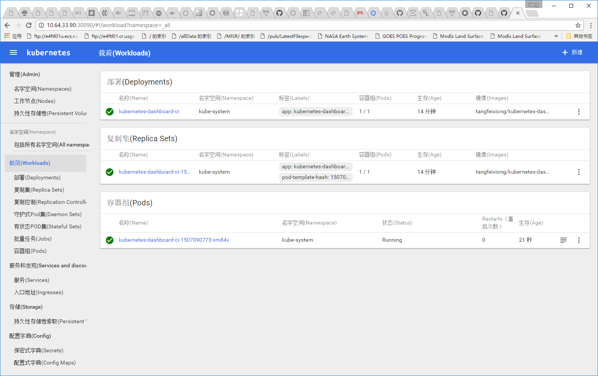

# I18N Chinese

## Fedora 23

OS info

	[tangfx@localhost dashboard]$ cat /etc/os-release
	NAME=Fedora
	VERSION="23 (Twenty Three)"
	ID=fedora
	VERSION_ID=23
	PRETTY_NAME="Fedora 23 (Twenty Three)"
	ANSI_COLOR="0;34"
	CPE_NAME="cpe:/o:fedoraproject:fedora:23"
	HOME_URL="https://fedoraproject.org/"
	BUG_REPORT_URL="https://bugzilla.redhat.com/"
	REDHAT_BUGZILLA_PRODUCT="Fedora"
	REDHAT_BUGZILLA_PRODUCT_VERSION=23
	REDHAT_SUPPORT_PRODUCT="Fedora"
	REDHAT_SUPPORT_PRODUCT_VERSION=23
	PRIVACY_POLICY_URL=https://fedoraproject.org/wiki/Legal:PrivacyPolicy

	[tangfx@localhost dashboard]$ uname -a
	Linux localhost 4.8.13-100.fc23.x86_64 #1 SMP Fri Dec 9 14:51:40 UTC 2016 x86_64 x86_64 x86_64 GNU/Linux

Repo info

    [tangfx@localhost dashboard]$ ls /etc/yum.repos.d/
    fedora.repo          fedora-updates-testing.repo
    fedora-updates.repo  nodesource-fc.repo

	[tangfx@localhost dashboard]$ cat /etc/yum.repos.d/nodesource-fc.repo
	[nodesource]
	name=Node.js Packages for Fedora Core 23 - $basearch
	baseurl=https://rpm.nodesource.com/pub_6.x/fc/23/$basearch
	failovermethod=priority
	enabled=1
	gpgcheck=1
	gpgkey=file:///etc/pki/rpm-gpg/NODESOURCE-GPG-SIGNING-KEY-EL

	[nodesource-source]
	name=Node.js for Fedora Core 23 - $basearch - Source
	baseurl=https://rpm.nodesource.com/pub_6.x/fc/23/SRPMS
	failovermethod=priority
	enabled=0
	gpgkey=file:///etc/pki/rpm-gpg/NODESOURCE-GPG-SIGNING-KEY-EL
	gpgcheck=1
	
NodeJS

    [tangfx@localhost dashboard]$ node --version
    v6.9.2

	[tangfx@localhost dashboard]$ npm -v
    4.0.5
	
Java

    [tangfx@localhost dashboard]$ java -version
	java version "1.8.0_112"
	Java(TM) SE Runtime Environment (build 1.8.0_112-b15)
	Java HotSpot(TM) 64-Bit Server VM (build 25.112-b15, mixed mode)
	
Golang

	[tangfx@localhost dashboard]$ go version
	go version go1.6.2 linux/amd64

## Buld

Generate `messages-zh.xtb` and modify `local-config.json`

	tangf@DESKTOP-H68OQDV /cygdrive/g/work/src/k8s.io/dashboard
	$ ./chinese-lization.sh

Prepare offline icon fonts

    [tangfx@localhost dashboard]$ mkdir -p bower_components/material-design-icons/iconfont && cd bower_components/material-design-icons/iconfont
	
	[tangfx@localhost iconfont]$ curl https://raw.githubusercontent.com/google/material-design-icons/master/iconfont/material-icons.css -O
	  % Total    % Received % Xferd  Average Speed   Time    Time     Time  Current
									 Dload  Upload   Total   Spent    Left  Speed
	100   970  100   970    0     0    156      0  0:00:06  0:00:06 --:--:--   263
	[tangfx@localhost iconfont]$ curl https://raw.githubusercontent.com/google/material-design-icons/master/iconfont/codepoints -O
	  % Total    % Received % Xferd  Average Speed   Time    Time     Time  Current
									 Dload  Upload   Total   Spent    Left  Speed
	100 16289  100 16289    0     0   2563      0  0:00:06  0:00:06 --:--:--  3374
	[tangfx@localhost iconfont]$ curl https://raw.githubusercontent.com/google/material-design-icons/master/iconfont/README.md -O
	  % Total    % Received % Xferd  Average Speed   Time    Time     Time  Current
									 Dload  Upload   Total   Spent    Left  Speed
	100   316  100   316    0     0     50      0  0:00:06  0:00:06 --:--:--    66
	[tangfx@localhost iconfont]$ curl https://raw.githubusercontent.com/google/material-design-icons/master/iconfont/MaterialIcons-Regular.woff2 -O
	  % Total    % Received % Xferd  Average Speed   Time    Time     Time  Current
									 Dload  Upload   Total   Spent    Left  Speed
	100 44300  100 44300    0     0   6774      0  0:00:06  0:00:06 --:--:-- 11030
	[tangfx@localhost iconfont]$ curl https://raw.githubusercontent.com/google/material-design-icons/master/iconfont/MaterialIcons-Regular.woff -O
	  % Total    % Received % Xferd  Average Speed   Time    Time     Time  Current
									 Dload  Upload   Total   Spent    Left  Speed
	100 57620  100 57620    0     0   8807      0  0:00:06  0:00:06 --:--:-- 14351
	[tangfx@localhost iconfont]$ curl https://raw.githubusercontent.com/google/material-design-icons/master/iconfont/MaterialIcons-Regular.ttf -O
	  % Total    % Received % Xferd  Average Speed   Time    Time     Time  Current
									 Dload  Upload   Total   Spent    Left  Speed
	100  125k  100  125k    0     0  19089      0  0:00:06  0:00:06 --:--:-- 30533
	[tangfx@localhost iconfont]$ curl https://raw.githubusercontent.com/google/material-design-icons/master/iconfont/MaterialIcons-Regular.svg -O
	  % Total    % Received % Xferd  Average Speed   Time    Time     Time  Current
									 Dload  Upload   Total   Spent    Left  Speed
	100  275k  100  275k    0     0  41652      0  0:00:06  0:00:06 --:--:-- 86985
	[tangfx@localhost iconfont]$ curl https://raw.githubusercontent.com/google/material-design-icons/master/iconfont/MaterialIcons-Regular.ijmap -O
	  % Total    % Received % Xferd  Average Speed   Time    Time     Time  Current
									 Dload  Upload   Total   Spent    Left  Speed
	100 28416  100 28416    0     0   4413      0  0:00:06  0:00:06 --:--:--  7269
	[tangfx@localhost iconfont]$ curl https://raw.githubusercontent.com/google/material-design-icons/master/iconfont/MaterialIcons-Regular.eot -O
	  % Total    % Received % Xferd  Average Speed   Time    Time     Time  Current
									 Dload  Upload   Total   Spent    Left  Speed
	100  139k  100  139k    0     0  21723      0  0:00:06  0:00:06 --:--:-- 35215
	
Generate _dist_

	[tangfx@localhost dashboard]$ locale
	LANG=zh_CN.UTF-8
	LC_CTYPE="zh_CN.UTF-8"
	LC_NUMERIC="zh_CN.UTF-8"
	LC_TIME="zh_CN.UTF-8"
	LC_COLLATE="zh_CN.UTF-8"
	LC_MONETARY="zh_CN.UTF-8"
	LC_MESSAGES="zh_CN.UTF-8"
	LC_PAPER="zh_CN.UTF-8"
	LC_NAME="zh_CN.UTF-8"
	LC_ADDRESS="zh_CN.UTF-8"
	LC_TELEPHONE="zh_CN.UTF-8"
	LC_MEASUREMENT="zh_CN.UTF-8"
	LC_IDENTIFICATION="zh_CN.UTF-8"
	LC_ALL=

	[tangfx@localhost dashboard]$ gulp build
	[23:26:32] Requiring external module babel-register
	[23:26:36] Using gulpfile /go/src/k8s.io/dashboard/gulpfile.babel.js
	[23:26:36] Starting 'clean-packaged-backend-source'...
	[23:26:36] Starting 'clean-dist'...
	[23:26:36] Starting 'buildExistingI18nCache'...
	[23:26:36] Starting 'scripts'...
	[23:26:36] Starting 'clean-messages-for-extraction'...
	[23:26:36] Starting 'styles:prod'...
	[23:26:36] Finished 'buildExistingI18nCache' after 383 ms
	[23:26:36] Starting 'angular-templates'...
	[23:26:36] Finished 'clean-packaged-backend-source' after 711 ms
	[23:26:36] Starting 'package-backend-source'...
	[23:26:36] Finished 'clean-messages-for-extraction' after 499 ms
	[23:26:37] Finished 'clean-dist' after 1.18 s
	[23:26:37] Starting 'fonts'...
	[23:26:37] Starting 'icons'...
	[23:26:37] Starting 'assets'...
	[23:26:37] Starting 'dependency-images'...
	[23:26:37] Starting 'locales-for-backend'...
	[23:26:37] Finished 'icons' after 19 ms
	[23:26:38] Finished 'dependency-images' after 1.14 s
	[23:26:38] Finished 'locales-for-backend' after 1.14 s
	[23:26:46] Finished 'assets' after 9.1 s
	[23:26:49] Finished 'scripts' after 14 s
	[23:26:50] Finished 'styles:prod' after 14 s
	[23:26:50] Finished 'fonts' after 13 s
	[23:26:50] Finished 'angular-templates' after 14 s
	[23:26:50] Starting 'extract-translations'...
	[23:26:50] Finished 'package-backend-source' after 14 s
	[23:26:50] Starting 'link-vendor'...
	[23:26:50] Finished 'link-vendor' after 1.87 ms
	[23:26:50] Starting 'package-backend'...
	[23:26:50] Finished 'package-backend' after 8.39 μs
	[23:26:50] Starting 'backend:prod'...
	[23:26:58] Finished 'extract-translations' after 7.88 s
	[23:26:58] Starting 'sort-translations'...
	[23:26:58] Finished 'sort-translations' after 103 ms
	[23:26:58] Starting 'generate-xtbs'...
	[23:26:58] Finished 'generate-xtbs' after 127 μs
	[23:26:58] Starting 'scripts:prod'...
	[23:28:41] Finished 'scripts:prod' after 1.7 min
	[23:28:41] Starting 'index:prod'...
	[23:28:41] Finished 'index:prod' after 198 ms
	[23:28:41] Starting 'frontend-copies'...
	[23:29:21] Finished 'frontend-copies' after 40 s
	[23:29:21] Starting 'localize'...
	[23:29:21] Finished 'localize' after 40 ms
	[23:29:21] Starting 'build-frontend'...
	[23:29:22] Finished 'build-frontend' after 231 ms
	[23:31:58] Finished 'backend:prod' after 5.12 min
	[23:31:58] Starting 'build'...
	[23:31:58] Finished 'build' after 3.32 μs

Or validate _dist_

	[tangfx@localhost dashboard]$ gulp serve:prod
	[23:36:36] Requiring external module babel-register
	[23:36:40] Using gulpfile /go/src/k8s.io/dashboard/gulpfile.babel.js
	[23:36:40] Starting 'clean-dist'...
	[23:36:40] Starting 'buildExistingI18nCache'...
	[23:36:40] Starting 'scripts'...
	[23:36:40] Starting 'clean-messages-for-extraction'...
	[23:36:40] Starting 'styles:prod'...
	[23:36:40] Starting 'clean-packaged-backend-source'...
	[23:36:40] Starting 'kill-backend'...
	[23:36:40] Finished 'kill-backend' after 86 μs
	[23:36:40] Finished 'buildExistingI18nCache' after 556 ms
	[23:36:40] Starting 'angular-templates'...
	[23:36:41] Finished 'clean-messages-for-extraction' after 609 ms
	[23:36:41] Finished 'clean-packaged-backend-source' after 597 ms
	[23:36:41] Starting 'package-backend-source'...
	[23:36:42] Finished 'clean-dist' after 2.26 s
	[23:36:42] Starting 'fonts'...
	[23:36:42] Starting 'icons'...
	[23:36:42] Starting 'assets'...
	[23:36:42] Starting 'dependency-images'...
	[23:36:42] Starting 'locales-for-backend'...
	[23:36:42] Finished 'icons' after 130 ms
	[23:36:44] Finished 'dependency-images' after 2.05 s
	[23:36:44] Finished 'locales-for-backend' after 2.04 s
	[23:36:51] Finished 'assets' after 8.64 s
	[23:36:54] Finished 'scripts' after 14 s
	[23:36:54] Finished 'styles:prod' after 14 s
	[23:36:54] Finished 'fonts' after 12 s
	[23:36:55] Finished 'angular-templates' after 14 s
	[23:36:55] Starting 'extract-translations'...
	[23:36:55] Finished 'package-backend-source' after 14 s
	[23:36:55] Starting 'link-vendor'...
	[23:36:55] Finished 'link-vendor' after 3.81 ms
	[23:36:55] Starting 'package-backend'...
	[23:36:55] Finished 'package-backend' after 3.51 μs
	[23:36:55] Starting 'backend'...
	[23:37:03] Finished 'extract-translations' after 7.93 s
	[23:37:03] Starting 'sort-translations'...
	[23:37:03] Finished 'sort-translations' after 106 ms
	[23:37:03] Starting 'generate-xtbs'...
	[23:37:03] Finished 'generate-xtbs' after 4.88 μs
	[23:37:03] Starting 'scripts:prod'...
	[23:38:49] Finished 'scripts:prod' after 1.77 min
	[23:38:49] Starting 'index:prod'...
	[23:38:49] Finished 'index:prod' after 170 ms
	[23:38:49] Starting 'frontend-copies'...
	[23:39:23] Finished 'frontend-copies' after 34 s
	[23:39:23] Starting 'localize'...
	[23:39:23] Finished 'localize' after 29 ms
	[23:39:23] Starting 'build-frontend'...
	[23:39:23] Finished 'build-frontend' after 247 ms
	[23:39:41] Finished 'backend' after 2.75 min
	[23:39:41] Starting 'spawn-backend:prod'...
	[23:39:41] Finished 'spawn-backend:prod' after 18 ms
	[23:39:41] Starting 'serve:prod'...
	[23:39:41] Finished 'serve:prod' after 20 μs
	Using HTTP port: 9090
	Using apiserver-host location: http://10.64.33.81:8080
	Creating API server client for http://10.64.33.81:8080
	Successful initial request to the apiserver, version: v1.3.7
	Creating in-cluster Heapster client
	Getting application global configuration
	Application configuration {"serverTime":1482680449111}
	[2016-12-25T23:40:49+08:00] Incoming HTTP/1.1 GET /api/v1/workload/default?itemsPerPage=10&page=1 request from 10.64.33.1:63091
	Getting lists of all workloads
	Getting pod metrics
	Skipping Heapster metrics because of error: the server could not find the requested resource (get services heapster)
	[2016-12-25T23:40:50+08:00] Outcoming response to 10.64.33.1:63091 with 201 status code
	[2016-12-25T23:40:55+08:00] Incoming HTTP/1.1 GET /api/v1/deployment/default?itemsPerPage=10&page=1 request from 10.64.33.1:63091
	Getting list of all deployments in the cluster
	[2016-12-25T23:40:55+08:00] Outcoming response to 10.64.33.1:63091 with 201 status code
	[2016-12-25T23:40:59+08:00] Incoming HTTP/1.1 GET /api/v1/workload/default?itemsPerPage=10&page=1 request from 10.64.33.1:63091
	Getting lists of all workloads
	Getting pod metrics
	Skipping Heapster metrics because of error: the server could not find the requested resource (get services heapster)
	[2016-12-25T23:40:59+08:00] Outcoming response to 10.64.33.1:63091 with 201 status code

The home page

Docker image

	[tangfx@localhost dashboard]$ DOCKER_HUB_PREFIX=tangfeixiong gulp docker-image:head
	[23:52:29] Requiring external module babel-register
	[23:52:33] Using gulpfile /go/src/k8s.io/dashboard/gulpfile.babel.js
	[23:52:33] Starting 'clean-packaged-backend-source'...
	[23:52:33] Starting 'clean-dist'...
	[23:52:33] Starting 'buildExistingI18nCache'...
	[23:52:33] Starting 'scripts'...
	[23:52:33] Starting 'clean-messages-for-extraction'...
	[23:52:33] Starting 'styles:prod'...
	[23:52:34] Finished 'buildExistingI18nCache' after 526 ms
	[23:52:34] Starting 'angular-templates'...
	[23:52:34] Finished 'clean-packaged-backend-source' after 901 ms
	[23:52:34] Starting 'package-backend-source'...
	[23:52:34] Finished 'clean-messages-for-extraction' after 605 ms
	[23:52:34] Finished 'clean-dist' after 1.36 s
	[23:52:34] Starting 'fonts'...
	[23:52:34] Starting 'icons'...
	[23:52:34] Starting 'assets'...
	[23:52:34] Starting 'dependency-images'...
	[23:52:34] Starting 'locales-for-backend'...
	[23:52:34] Starting 'docker-file'...
	[23:52:35] Finished 'icons' after 20 ms
	[23:52:36] Finished 'dependency-images' after 1.14 s
	[23:52:36] Finished 'locales-for-backend' after 1.14 s
	[23:52:36] Finished 'docker-file' after 1.14 s
	[23:52:41] Finished 'assets' after 6.69 s
	[23:52:47] Finished 'scripts' after 14 s
	[23:52:48] Finished 'styles:prod' after 14 s
	[23:52:48] Finished 'fonts' after 13 s
	[23:52:48] Finished 'angular-templates' after 15 s
	[23:52:48] Starting 'extract-translations'...
	[23:52:48] Finished 'package-backend-source' after 14 s
	[23:52:48] Starting 'link-vendor'...
	[23:52:48] Finished 'link-vendor' after 568 μs
	[23:52:48] Starting 'package-backend'...
	[23:52:48] Finished 'package-backend' after 21 ns
	[23:52:48] Starting 'backend:prod'...
	[23:52:56] Finished 'extract-translations' after 7.81 s
	[23:52:56] Starting 'sort-translations'...
	[23:52:56] Finished 'sort-translations' after 100 ms
	[23:52:56] Starting 'generate-xtbs'...
	[23:52:56] Finished 'generate-xtbs' after 25 μs
	[23:52:56] Starting 'scripts:prod'...
	[23:54:43] Finished 'scripts:prod' after 1.77 min
	[23:54:43] Starting 'index:prod'...
	[23:54:43] Finished 'index:prod' after 380 ms
	[23:54:43] Starting 'frontend-copies'...
	[23:55:20] Finished 'frontend-copies' after 37 s
	[23:55:20] Starting 'localize'...
	[23:55:21] Finished 'localize' after 49 ms
	[23:55:21] Starting 'build-frontend'...
	[23:55:21] Finished 'build-frontend' after 229 ms
	[23:57:57] Finished 'backend:prod' after 5.13 min
	[23:57:57] Starting 'build'...
	[23:57:57] Finished 'build' after 85 μs
	[23:57:57] Starting 'docker-image:head'...
	Sending build context to Docker daemon 120.5 MB
	Step 1 : FROM scratch
	 --->
	Step 2 : MAINTAINER Piotr Bryk <bryk@google.com>
	 ---> Using cache
	 ---> 3433312ba66e
	Step 3 : ADD . /
	 ---> 299b0ffecf5b
	Removing intermediate container ea58de0e08a5
	Step 4 : EXPOSE 9090
	 ---> Running in d73908b4670e
	 ---> 5a8f31a673f6
	Removing intermediate container d73908b4670e
	Step 5 : ENTRYPOINT /dashboard --port=9090
	 ---> Running in 5a732b95904a
	 ---> a684fcee0855
	Removing intermediate container 5a732b95904a
	Successfully built a684fcee0855
	[23:58:14] Finished 'docker-image:head' after 17 s

	[tangfx@localhost dashboard]$ docker images tangfeixiong/kubernetes-dashboard-amd64
    REPOSITORY                                TAG                 IMAGE ID            CREATED             SIZE
    tangfeixiong/kubernetes-dashboard-amd64   head                a684fcee0855        2 minutes ago       120.2 MB

Deploy

	[tangfx@localhost dashboard]$ vi src/deploy/kubernetes-dashboard-head.yaml
	###
	image: kubernetes/kubernetes-dashboard-amd64:head # kubernetesdashboarddev/kubernetes-dashboard-amd64:head
	###

	[tangfx@localhost dashboard]$ kubectl create -f src/deploy/kubernetes-dashboard-head.yaml
    replicationcontroller "kubernetes-dashboard-head" configured
    service "dashboard-head" configured

	[tangfx@localhost dashboard]$ kubectl --namespace=kube-system get pods -l app=kubernetes-dashboard-head -o wide
    NAME                              READY     STATUS    RESTARTS   AGE       IP            NODE
    kubernetes-dashboard-head-38xus   1/1       Running   0          1d        10.120.76.3   10.64.33.90

	[tangfx@localhost dashboard]$ kubectl --namespace=kube-system get service/dashboard-head -o jsonpath={.spec..nodePort}
    30410

	[tangfx@localhost dashboard]$ curl 10.64.33.90:30410
	 <!doctype html> <html ng-app="kubernetesDashboard"> <head> <meta charset="utf-8"> <title>Kubernetes Dashboard</title> <link rel="icon" type="image/png" href="assets/images/kubernetes-logo.png"> <meta name="viewport" content="width=device-width"> <link rel="stylesheet" href="static/vendor.0b581f94.css"> <link rel="stylesheet" href="static/app.968d5cf5.css"> </head> <body> <!--[if lt IE 10]>
		  
You are using an <strong>outdated</strong> browser.
		  Please <a href="http://browsehappy.com/">upgrade your browser</a> to improve your
		  experience.

		<![endif]--> <kd-chrome layout="column" layout-fill> </kd-chrome>    </body> </html> 	

		